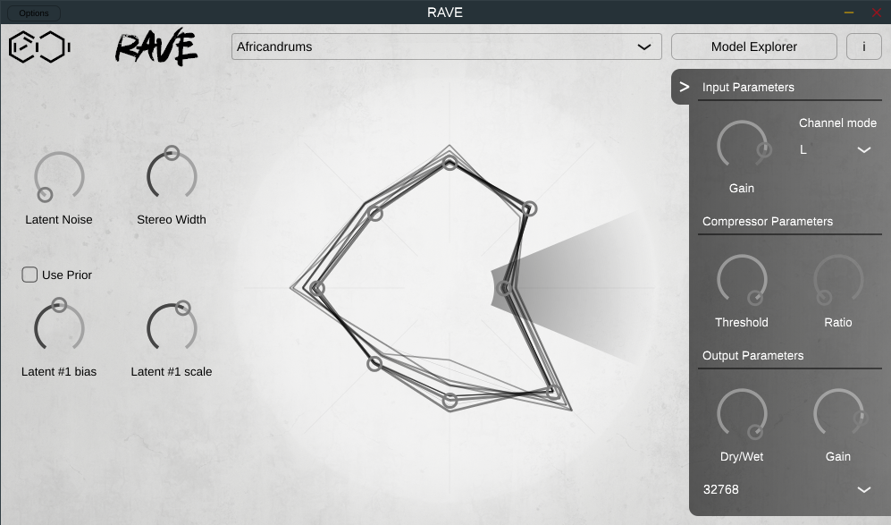

# RAVE VST (BETA)
-----
Include RAVE models in your DAW for realtime deep learning based processing

- VST / AU / Standalone plugins available
- MacOS (M1 works, but you'll need to build yourself) & Unix (Windows build is still experimental at this point)
- Reconstruction & Prior modes available

-----
### 1) How to use
##### Audio settings
Click on the button with an arrow on the right to open / close the audio settings panel. Here you can adjust:
  - Input: Gain, Channel, Compression threshold & ratio
  - Output: Gain & Dry / Wet mix
  - Buffer size: Internal buffer size used (small buffer size = low latency, more audio clicks)

-----
You can switch between reconstruction & prior modes using the tickbox on the left
##### Reconstruction mode
In reconstruction mode, RAVE will use the audio input given by your DAW and reconstruct it
- Latent bias & scale can be changed for each of the 1st 8 latents: Select the latent you want to edit on the central wheel, then use the two bottom left buttons to change the values

##### Prior mode
In Prior mode, RAVE will move through the latent space using its prior
- You can adjust the latent noise, which will add noise to all latent dimensions

-----
##### Stereo Width
This knob set the audio separation between the two output channels of the RAVE model.  
Those two channels have the same input but the random sampling differences will produce slightly different outputs, resulting in a nice stereo effect

-----
##### Model Explorer
The Model Explorer Button switches to the model explorer window.   
- **Model download:**  
Download models available from our API  
If you want to submit your own checkpoints to be available via our API please open an issue tagged "enhancement" and we'll gladly serve them :)
- **Custom models import:**  
Use this to select your custom models in your file explorer, this will put them in the right folder and refresh the available models list.  
If you want to manage yourself your local models, the files are located in:
  - ``~/.config/ACIDS/RAVE/`` (UNIX)
  - ``~/Library/Application Support/ACIDS/RAVE/`` (MacOS)

-----
##### Using your own trained models  
If you want to be able to use your [trained models](https://github.com/acids-ircam/RAVE) in the VST **you have to [export them](https://github.com/acids-ircam/RAVE/blob/master/export_rave.py#L21) with the ``--stereo true`` flag**  
Then use the VST import button to move the files in the correct folder as explained in the previous section

-----
### 2) How to install
To get the precompiled binaries
- Go to the "Actions" panel of this repository
- Select the last run
- Download the binaries for your OS

-----
### 3) How to build
We use Cmake for the build process  
PyTorch libraries (And MKL if you're on UNIX) will be downloaded automatically  

Tested environments:

| OS                     | CMake  | C++ Compiler | Available formats     | Notes                                  |
|------------------------|--------|--------------|-----------------------|----------------------------------------|
| **MacOS** 10.15.7      | 3.21.3 | Clang 11.0.3 | VST / Standalone / AU |                                        |
| **MacOS M1** 12.3.1    | 3.20.3 | Clang 12.0.0 | VST / Standalone / AU | Clang ARM                              |
| **Ubuntu** 20.04.4 LTS |        | G++ 9.4.0    | VST / Standalone      |                                        |
| **Arch Linux**         | 3.23.2 | G++ 12.1.0   | VST / Standalone      | use JUCE:develop branch, see issue #19 |
| **Fedora** 33          | 3.19.7 | G++ 10.3.1   | Standalone            |                                        |
| **Windows** 10         | 3.23.1 |              | Standalone            | Experimental                           |

#### 1) If compiling on UNIX, install the needed dependencies:
- Ubuntu:  
`sudo apt-get update && sudo apt-get install -y git cmake g++ libx11-dev libxrandr-dev libxinerama-dev libxcursor-dev libfreetype-dev libcurl4-openssl-dev libasound2-dev`
- Fedora:  
`sudo dnf update ; sudo dnf install git cmake g++ libX11-devel libXrandr-devel libXinerama-devel libXcursor-devel freetype-devel libcurl-devel alsa-lib-devel`
- Arch Linux:
`sudo pacman -S git cmake gcc libx11 libxrandr libxinerama libxcursor freetype2 libcurl-compat alsa-lib` (or libcurl-gnutls)

#### 2) Clone the repository:
`cd {YOUR_INSTALL_FOLDER} ; git clone git@github.com:acids-ircam/rave_vst.git ; cd rave_vst`

#### 3) Get Juce:  
- Ubuntu / Fedora 33: `git submodule update --init --recursive --progress`
- Arch Linux: `git clone -b develop --single-branch https://github.com/juce-framework/JUCE; mv JUCE juce`

#### 4) Setup the build:  
`mkdir build; cd build`  
`cmake .. -DCMAKE_BUILD_TYPE=Release`

#### 5) Build:  
`cmake --build . --config Release -j 4`

#### 6) Enjoy!
Once the build process finished you'll find the compiled binaries located in `rave-vst/build/rave-vst_artefacts/Release/`  

- MacOS: `./build/rave-vst_artefacts/Release/Standalone/RAVE.app/Contents/MacOS/RAVE`  
- UNIX: `./build/rave-vst_artefacts/Release/Standalone/RAVE`  
- Windows: `./build/rave-vst_artefacts/Release/Standalone/RAVE.exe`  
